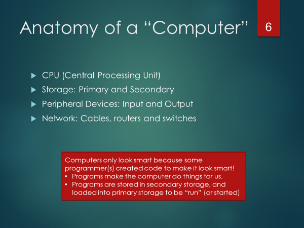
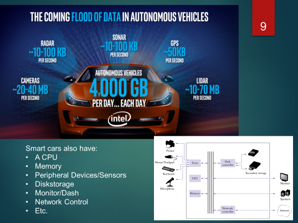
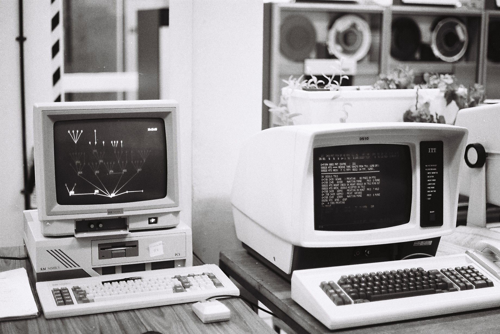
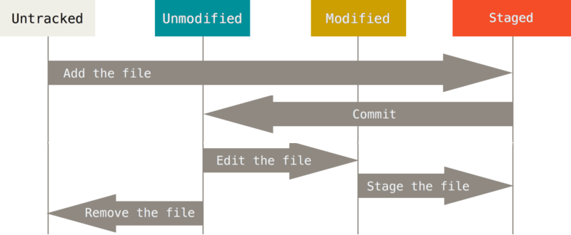
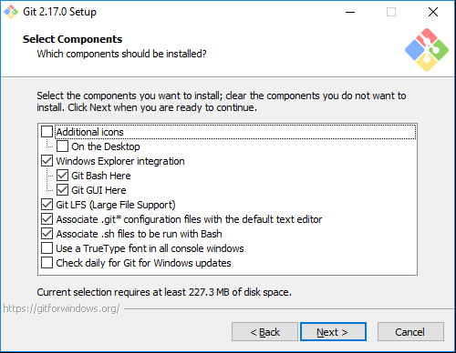
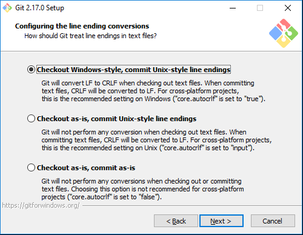
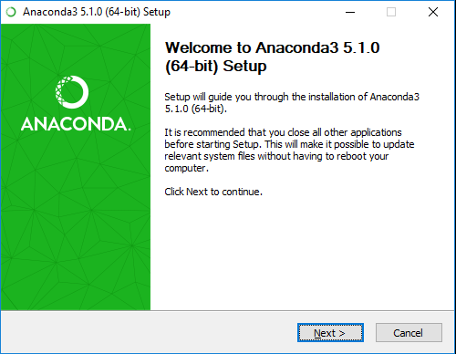
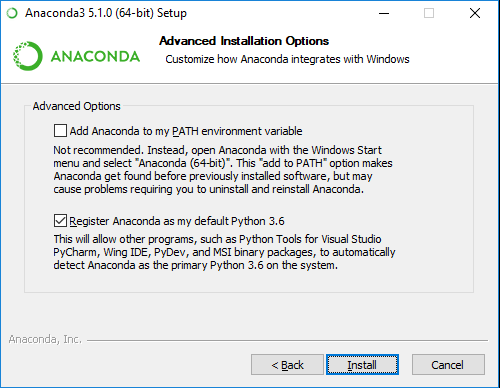
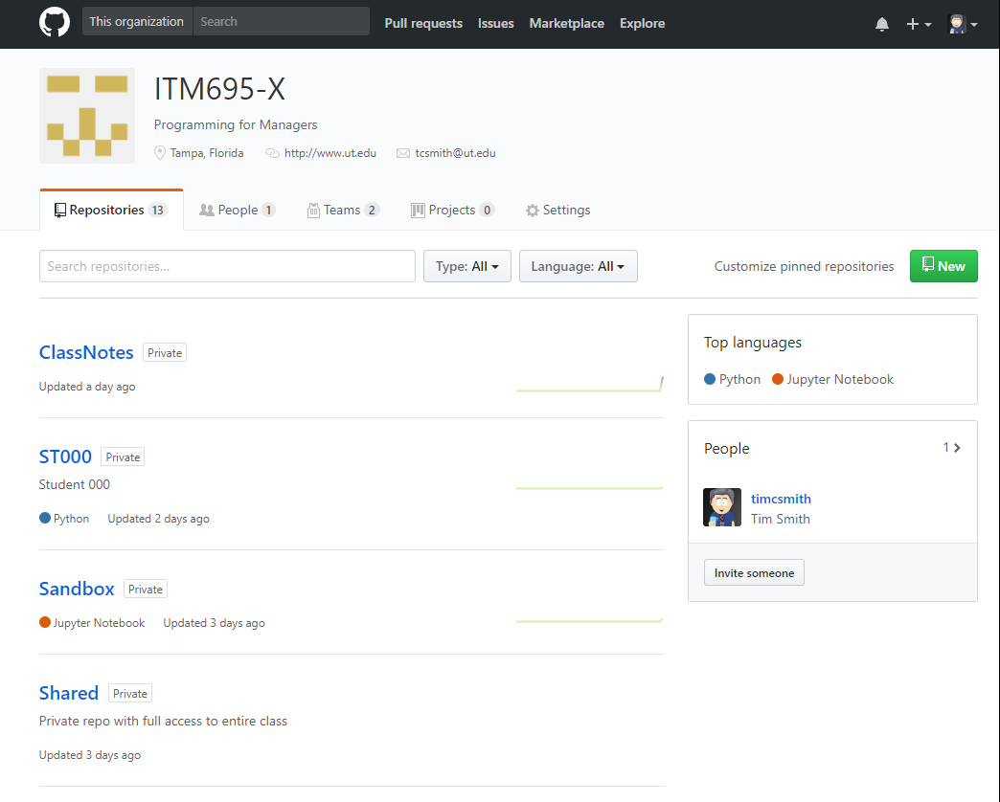
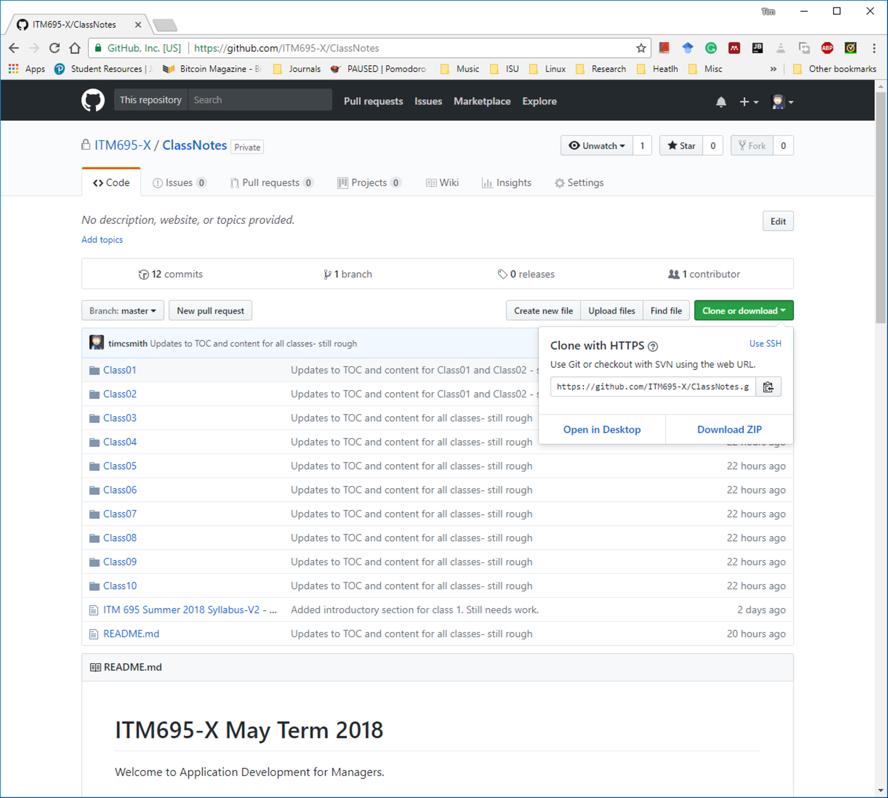

# Class01 - TOC

[TOC levels=4 numbered]: # "Class01"

- [Class01 - TOC](#class01---toc)
- [Objectives](#objectives)
- [Topics](#topics)
  - [Introduction to Programming (and Python)](#introduction-to-programming-and-python)
    - [What is a program?](#what-is-a-program)
    - [Python](#python)
    - [Why Python?](#why-python)
    - [More background on Python](#more-background-on-python)
      - [Python Enhancement Proposals (PEPs)](#python-enhancement-proposals-peps)
  - [Python Terms](#python-terms)
    - [Why do this? Don't be a Pakled.](#why-do-this-dont-be-a-pakled)
  - [Getting to Know your Computer](#getting-to-know-your-computer)
    - [What happens when you "run" a python program](#what-happens-when-you-%22run%22-a-python-program)
    - [Introduction to the command line](#introduction-to-the-command-line)
    - [What about shells?](#what-about-shells)
    - [We will not make heavy use Shells/Terminals/Consoles in this course...](#we-will-not-make-heavy-use-shellsterminalsconsoles-in-this-course)
    - [Resources for Learning Command (CMD) Line (using Bash)](#resources-for-learning-command-cmd-line-using-bash)
  - [Introduction to Git & GitHub](#introduction-to-git--github)
    - [Installing Git](#installing-git)
    - [Creating and using GitHub account](#creating-and-using-github-account)
  - [Installing Anaconda](#installing-anaconda)
    - [The two major version of Python](#the-two-major-version-of-python)
    - [Anaconda](#anaconda)
    - [Download and install Anaconda](#download-and-install-anaconda)
  - [Installing PyCharm](#installing-pycharm)
  - [Initial settings/setup of VSCode](#initial-settingssetup-of-vscode)
    - [Test your installation by writing your first program](#test-your-installation-by-writing-your-first-program)
    - [Cloning course repos](#cloning-course-repos)
  - [Introduction to Markdown](#introduction-to-markdown)
    - [Installing Markdown Navigator](#installing-markdown-navigator)
  - [Useful online resources](#useful-online-resources)
- [Summary](#summary)
- [In class work](#in-class-work)
  - [Practice Exercises](#practice-exercises)
    - [Exercise01: Hello World - GitHub Tutorial](#exercise01-hello-world---github-tutorial)
    - [Exercise02: Update your private repo](#exercise02-update-your-private-repo)
    - [Exercise03: Create a README.md file within the root directory of you your private repo.](#exercise03-create-a-readmemd-file-within-the-root-directory-of-you-your-private-repo)
    - [Exercise04: Create a public repo](#exercise04-create-a-public-repo)
  - [Assignment01](#assignment01)

# Objectives

* Introduce Basic Computer Architecture and Command Line interface
* Introduce and install Git and GitHub
* Provide an introduction to application development and the role of programming and programming languages.
* Introduce Python (and the Anaconda Edition we'll be using)
* Introduce VSCode editor
* Develop your first program
* Create a GitHub account and join the Team Repos for this class.
* Clone the class repos into your project.
* Practice staging, committing, pushing and pulling project changes.
* Complete Assignment #1 and Quiz#1.

# Topics

## Introduction to Programming (and Python)

### What is a program?

A program is a sequence of instructions to accomplish a task. A programming language is different than a "natural language" (i.e., English, French, Spanish); it's much more formal and meant to force the "speaker" of the language to be very specific. The "listener" of the language is the computer, and computers have difficulties with nuanced communication and thus require very detailed and specific instructions on how to perform any task. NOTE: Computers only look smart because some programmer(s) make it look that way.

###  Python

The programming language you will be learning in this course is Python. There are many other languages out there. Some languages are general purpose -  in that they are meant to allow a programmer to create virtually any application, while others are more domain specific and focus on a subset of programs/application development (i.e. Mathematica, MatLab)

Python is classified as a "high-level" language. High-level languages are much easier to work with than low-level languages (such as assembler, and to some extent, C). Most programs are developed in high-level languages. Low-level languages are used to develop programs that are "close to the machine" and involve things like creating device drivers, and specific programs to work with low-level features of a computer chip.

### Why Python?

There are literally [hundreds of programming languages](https://en.wikipedia.org/wiki/List_of_programming_languages) to choose from.

'Which language is more popular' is an often asked question. If you hear x language is the most popular, or y language has grown in use more than any other languages - such simple statements are often misguided. For instance, if you were working for company that developed very low level embedded systems (low level programming) used by motherboard manufacturers, you'd look foolish proposing that the company switch it's language to Java (a high level graphical programming language) because it was "more popular" than the current language the company was using (such as C, or assembler). So, when assessing what "the best language is", context matters.

That being said, in aggregate, Python is one of the [most popular programming languages](https://stackoverflow.blog/2017/09/06/incredible-growth-python/) used within "high income" countries (United States, United Kingdom, Germany, Canada, etc.).


Python is also particularly well suited for [data science, machine learning, and predictive analytics](https://stackoverflow.blog/2017/09/14/python-growing-quickly/) contexts - as well as Cybersecurity (ever watch Mr. Robot? When any code is shown, it's Python or Bash).

Python is one of the most accessible "professional level" languages to learn (by "professional level" I'm excluding languages that were developed purely for learning purposes, such as Alice).

Even if you don't plan to program, conduct data science/data analysis, or packet sniff or penetration test, etc. -- knowing a programming language may save your job, or help you get a new one.

[](https://www.youtube.com/watch?v=mgeInzokcQc "Learn to code, it might save your job")

This course will give you the necessary foundational knowledge of the language and tools so that you can more confidently access the many resources found on the internet to help you further develop your skills for whatever specialties you choose.

### More background on Python

Not named after snake, but from Monty Python (The original creator of Python, Guido Van Rosssum, was a big fan of Monty Python, and the  Python documentation and community can reflect this and be a bit humorous/whimsical)

Python has a unique culture and community based on it's core design philosophy on readability and syntax that enables you to write concise programs.

####  Python Enhancement Proposals (PEPs)

* Python language development is managed through PEP's
    * https://www.python.org/dev/peps/
* Examples:
    * PEP0 provides index to the PEPS
    * PEP1 states the purpose of PEPS
    * PEP8 provides a style guide for python code
* PEP20 -- is known as the Zen of Python
  * Design principles for Python code
  * 20 aphorisms, but only 19 have been written down
  * Accessible from Python Shell
  * (exec. 'import this' from inside shell)


## Python Terms

* Code that fits the philosophy of python is called **Pythonic**.
    * Pythonic has many positive connotations
    * Unpythonic is a negative term 
* Python practitioners are called Pythonistas, Pythonists (or other play-on-words of Python)


Before we get into learning Python and programming, there is much for us to setup and understand.

In this course, you will be creating a workflow using tools such as Git, GitHub, and VSCode. These are the tools that a modern professional programmer will use. Git/GitHub skills are themselves especially new and in high demand.

In the following sections we'll get to know a bit more about your computer, learn about terminals, consoles, and shells, about version control systems (Git) and code sharing repositories (GitHub), about documentation using markdown, and working with our development.

### Why do this? Don't be a Pakled.

[](https://youtu.be/KeFoGo3N_4g)


## Getting to Know your Computer






### What happens when you "run" a python program


A programmer creates Python code using an editor (we will be using an Integrated Development Environment which contains an advanced Python editor).

The editor saves this code in a .py file.

The python interpreter compiles the .py  so that the code will run on the local machine/hardware. Though Python is often referred to an Interpreted language (versus a compiled language), Python does, in fact, compile the code into bytecode that then runs on a Python Virtual Machine. After running/using a python model you'll often see a .pyc file, this is python storing the compiled code in a bytecode file to save time and run faster in the future. If the code changes the .pyc will be updated).

The .pyc file contains bytecode – this cannot be read by humans, nor directly by the computer hardware, it’s meant only to be read by the Python virtual machine.

The Python virtual machine reads the .pyc file and “runs” the program by translating the bytecode to local instructions specific to the “machine” (computing device which the program is running on)


### Introduction to the command line


In the image below we find a PC on the left, and one of many "dumb terminals" on the right.



Before the development of personal computers, computer systems were large and centralized. Access to these large "mainframe" (and later "mini") computers was generally through what were called "dumb" terminals. These terminals had very little to no processing power, and simply "knew" how to display text and read input that would be sent across a wire to the central computer. These terminals where physical extensions of the main computer. Many terminals were connected to the same computer.

Terminals were used by programmers and users to accomplish tasks. You might access via a user console, an operator console, or an administrator console. Each of these offered particular uses of the main computer.

With the advent of the PC, both the processing (mainframe) and the console (terminal) were merged into one personal device.

Initial computers were not multi-tasking. One user, using a single console, would start and run one program.

As PC's evolved, their operating systems became more sophisticated, and we began to see a duplication of the mainframe architecture; that is, a user could have multiple "terminals" (in this case, they would use software, not hardware) that they would use to access the same core system processor.


So, for modern computers, should we these ways of accessing the computer a terminal? or a console?

As we see from the historical context of the mainframe world, in a sense, we could use these terms interchangeably. When I'm working as an admin, I may open an admin console. This would be done by running terminal software. Frankly, though, these terms are often used synonymously.

### What about shells?

Now, we have a third term that is often used synonymously with the other two -- that is "shell".

When computers began having software terminals, the user needed a  "language" to communicate with the computer. The language we use is presented as a user shell... a wrapper, in a sense, or what has become known as a shell (program), that provides a user interface (through a language) to the system.

On Linux, and most flavors of Unix, the most common shell is BASH (Born Again Shell). This is also the shell used in MacOS (which is an extension of Unix). Another popular shell is zsh (z-shell) - used commonly by developers in MacOS.

Microsoft and the general "PC" market did not evolve from Unix, and therefore developed a different technical approach to creating a terminal, and communicating via a shell to the core computer. There's no need to get into great detail about this for this class, other than to associate what we've already covered with how Windows handles things.

In windows, our terminal and shell is commonly called the "command prompt," "command terminal," or "command shell" (NOTE: A prompt is simply a curser that indicates that system is waiting for input). Most modern versions of windows (especially the server variety) have another type of terminal access, that referred to as "Powershell".


### We will not make heavy use Shells/Terminals/Consoles in this course...

In this course, we will review a few commands so that you can become familiar with the basic commands available in Bash and/or windows command prompt (NOTE: With the installation of Git on a PC, we get a Bash command shell. This behaves pretty much the same as the Bash shells found on any Unix and MacOS system). I'd recommend that you get familiar with using the bash shell (and most of my examples will use the bash shell). Our primary focus though will be on learning Python, knowing the command line will just help you "get around" your computer.


### Resources for Learning Command (CMD) Line (using Bash)

You will not be required to develop bash scripts in this course, but if you want to, you can quickly learn how to do such things. For a comprehensive introduction to the full "power" afforded by bash, I'd suggest working through the examples found http://www.tldp.org/LDP/Bash-Beginners-Guide/html/Bash-Beginners-Guide.html, then here http://tldp.org/HOWTO/Bash-Prog-Intro-HOWTO.html and finally here http://www.tldp.org/LDP/abs/html/.

Also, there is a free course on Codeacademy (https://www.codecademy.com/learn/learn-the-command-line) that provides an excellent introduction to Bash.


There are nine basic bash commands you should familiarize yourself with:
```
pwd
cd
ls
cat
cp
mv
rm
rmdir
mkdir
```

To get help with any of these command, simply add the command line switch --help. For instance, to get help on ls, type

```
ls --help
```

To run a program, you simply type the program name at the command prompt. For instance, if you wish to run a (non-compiled) version of a python program you're writing (which you've saved as hello.py) you would type the following.

```
python hello.py
```

## Introduction to Git & GitHub

Git is a program used to manage code repositories. It provides strict version control, and
allows you to manage large projects and your ongoing work better.


VCS (Version Control Systems)/ CVS (Code versioning system) such as Git are incorporated into developer workflow. Within any professional programming environment, you will find a VCS is being used.

When writing programs you'll often collaborate with others to create an application. Developing large applications can be complex, often involving 100's of files of source code, libraries and configuration files. Merely using a shared drive is not manageable -- as work can be easily lost when someone overwrites your work and does not merge it with their own work.  Even when not collaborating with others, developing software can often take months, or even years, of development effort. Managing all the files, updates to files, releases of the software, etc. can become very cumbersome and error-prone. This is where a VCS  can help significantly with the management of your application development.

Though there are a number of CVS's out there, Git has grown to be one of the most popular (partly attributed to GitHub, which provide server space to store code and share with others -- creating a community of "social coding" where people can "fork" and update your code, provide suggestions or updates (through "pull requests") -- all when maintaining fine-grained control over the history of changes to files.

The following two videos (10 and 15 minutes in length) provide a gentle introduction to Git and GitHub.


[](https://www.youtube.com/watch?v=9GKpbI1siow "Git Part 1")


[](https://www.youtube.com/watch?v=n-p1RUmdl9M/0.jpg "Git Part 2")


When managing files in Git, files begin as **untracked**. As files are added to tracking, then they are **staged**. The **staged** files are then **committed** to the repository (repo) with a **commit** command (you usually include a message).

When changing files that are tracked by Git, they enter a **modified** state. Once changes are ready to be added to the repos, **modified** files are **staged** and then **committed**.



If a mistake is made, we can roll-back any changes to a previous commit. Also, we can have various versions of our project in branches. A common pattern is to have three levels of staging. The development branch, the testing branch, and then the master "release" branch.

Let's install git, and pracdtice using it.

### Installing Git

Download Git from the following link https://git-scm.com/download/win

The web page should automatically begin downloading the correct version -- but, if you have
a 64-bit machine, make sure you're downloading the 64-bit edition (it will say in the
title of the download)

Select the appropriate installation program to install.

NOTE: You may get a pop-up window that asks if you approve this program to make changes
to your computer. Select yes. Once the installation is running, you'll see this initial
screen.


Select next. In the following screen, you'll be asked for the destination where the
program will be installed. Unless you have reasons to do otherwise (and you know well
the OS and filesystem) leave this to the default value.


Click next, and then you will be presented with the "select components" dialog.



Accept the defaults but add a check next to the last two options… as follows:


NOTE: MacOS and Linux will most likely not have the second last option. No need
to set this on those platforms.

In the next dialog box, keep the default settings.


In the next dialog box select Use Nano (Do NOT LEAVE THE DEFAULT TO VIM, unless
you're a "power user" who's had experience using VIM).


In the next window, accept the defaults.


Also, keep the defaults for the next dialog (which will look different, or not even asked,  on MacOS)


Leave the next screen at its default settings.



As well as the next (leave default settings)


And leave the next screen to its default settings and then click install.


Once installation begins, you'll see the following screen.


Then in the final screen, click finish.


### Creating and using GitHub account

Go to github.com and follow the procedure to create an account.

Send an email with your account information to the professor (tcsmith@ut.edu). The professor will add you to the class repositories. Once he as added everyone, the professor will demonstrate the basic navigation of the site.


## Installing Anaconda

### The two major version of Python

There are two versions of Python, the 2.x series, and the 3.x series. Unlike most languages that retain backward compatibility, version 3.x python shed some of the old ways of working in python. This was necessary to clean up and refresh the language (other languages, such as Java, have retained backward compatibility, but it also creates a lot of complexity as new layers of ways of doing things are plastered on top of old ways. With Python's clean break from the past, there were free to make changes and not increase the complexity of working in the language by having to retain old ways of doing things. There was a downside to this approach though, and that is that early Python programs needed to be "ported" (a computer programming term for rewriting the program) for the new Python 3.x language. Also, programmers had to learn the new syntax and concepts, and many were reluctant. It has taken many years, but much of the Python codebase has been ported to version 3.x, and most programmers now use the new version.

### Anaconda

Anaconda is Python 3 with many of the common libraries used in data science added into one large install package. For this course, we'll be using the Anaconda version of Python. NOTE: This version of Python is no different than the official version of Python 3.x that can be found on Python.org - it just adds many pre-configured libraries.

### Download and install Anaconda

Download anaconda from the anacondo.org website. The download page is located
at https://www.anaconda.com/download/

On this screen, you should see the option to install either Python 3.6 or
Python 2.7. We will be using Python 3.6, so it's important that this is the
version your install.

Under Python 3.6, you may have the choice of 32-bit or 64-bit versions. Most modern computer(within the last 3-4) are 64 bit (if you don't know for sure, see here for how to check https://www.lifewire.com/am-i-running-a-32-bit-or-64-bit-version-of-windows-2624475)


Once downloaded (it's a large file) you need to go into your download directory and run the installation program.

The first screen you see should be as follows…




Click next:

The next screen is the License Agreement. Click agree if you agree.


Next, you'll be presented with the following screen. Unless you have reason to do otherwise, keep the default to "Just Me"


Next, you'll need to supply the location to install the application. Unless you have good reason to do otherwise, leave this to the default location already set.


On the next screen, just accept the default (as seen in this screen capture)



Select install, and now you will be presented with an install progress screen.


Once completed, you will be presented with the final screen. Select finish.


## Installing PyCharm

VSCode is included in the Anaconda instllation. At some point, you'll be asked if you want to install it -- say yes, and just accept the defaults during the installation.

## Initial settings/setup of VSCode

VSCode is very extensible, with many addon's available. 

The professor will walk you through the initial setup of useful addons for Python programming.

### Test your installation by writing your first program

Let's create and run our first program. Traditionally, this is a "Hello World" program that simply prints the phrase Hello World to the screen.

The professor will walk you through this process and running your first program.

### Cloning course repos

We will now download our class repos into our project.

Your personal repo (see you professor for your assigned repos name)
* Shared
* ClassNotes
* Tests
* Assignments

To download each of these, you will need to find the address for the GitHub repository.

Go to the class website found at github.com/ITM695-X

You should find a list of available repos.



You'll need to download each one of these. Go into the folder for the repo you want to download, and select "clone or download" and copy the web link that is shown.




Once you've copied this address, then you can clone this repository to your local drive.

Open a terminal in the directory that you will store your repos. 

ON the command line, for each repo, type the following:

`git clone <address of our repos>`

## Introduction to Markdown

Most of the material for this course is written in Markdown. Markdown is a simplified means of creating HTML pages (and other documents).

The Markdown language is quite simple and will benefit you to know.

PS: We'll discuss "pull requesting" later, but this allows you to propose an addition and/or correction to an existing repo that you do not own. For this course, if you see a typo, or would like to add to the content, you can set up a pull request with the requested change to the course content.

See the markdown "cheat sheet" for all you'll need to write/edit Markdown files.

https://github.com/adam-p/markdown-here/wiki/Markdown-Cheatsheet


### Installing Markdown Navigator

VSCode supports creating and viewing Markdown files, but there is a plugin that improves upon this base functionality.

The professor will walk you through how you can install the plugin in VScode.

## Useful online resources

We'll be working through much of the material found in the online book "How to think like a computer scientist."
http://openbookproject.net/thinkcs/python/english3e/

Though this has the term "computer scientist" in the title, it's not as technical as a computer science course would be... instead, it provides an excellent gentle introduction to software developing using python.

Other resources include:

[Stack Overflow](https://stackoverflow.com/) is the most popular site for programmers to share knowledge. You can search for previous questions/answers, or post one yourself. Be sure to be very detailed in any question you post, and include the source code you're having problems with or have a question about.

[Code Academy](https://www.codecademy.com/en/tracks/python) has a number of free online courses. They have an introductory Python section that provides an interactive introduction to basic Python.

[Official Python Documentation](https://docs.python.org/3/) available from Python.org is the documentation developed by the core Python team. It contains a wealth of information on Python but serves more as a reference than a tutorial.

# Summary

Today we covered much ground. 

* Basics about computer operating systems, file systems, and command line interface
* Installation and introduction to Git and Git Hub
* Installation and introduction to Python (Anaconda Edition)
* Installation and introduction to the PyCharm IDE
* Integration between PyCharm IDE and Git/GitHub
* Setting up your GitHub account and cloning the class repos into your PyCharm project.
* Writing your first program ("Hello World")


# In class work

## Practice Exercises

Exercises are not marked. They are an opportunity for you to practice the material from class while getting support from the professor and peers.

>NOTE1: If you get stuck, you can reach out to fellow students and the professor. You will benefit most from this exercise is you first try on your own before seeking help. Trying to work through issues is how you develop your problem solving skills.

>NOTE2: I will be looking for evidence that you've completed the exercises when determining your final class participation grade and repository management grade.


### Exercise01: Hello World - GitHub Tutorial
* Complete the Git Hub introductory tutorial --
* [Git Hub Tutorial](https://guides.github.com/activities/hello-world/)

### Exercise02: Update your private repo
* First, make sure you have successfully cloned your personal repo to your local drive.
* In your local private repo, create four folders Assignments, Exercises, Tests, and Sandbox.
    * Sandbox will be where you can place your experimental code (an area where you can experiment and learn without messing up your organized folders).
    * Create a file called Exercise02.md within the Exercises folder
    * Copy the instructions for Exercise02 into this Exercise01.md file
    * Move your HelloWorld.py program into the Sandbox folder within your personal repo (ST????).
    * Commit these changes to your ST??? repo, and then push this commit to GitHub
    * Login to your GitHub account
    * Find and save a screen capture of the Commit history for your ST??? repo.
    * Find and save a screen capture of the Changes made by the resent commit.
    * Send both screen captures via email to the professor.


### Exercise03: Create a README.md file within the root directory of you your private repo.

* Using VSCode create a README.md file within the root directory of your ST??? personal repo
* Edit the README.md file using the following template:

```markdown
# Welcome to my ITM695-X repo

### Name
### Masters Degree being sought (and specialization/major)
### Undergrad Degree and Major
### Email address

### About me:

<Insert a brief paragraph that introduces yourself -- mention your personal and/or professional interests and what you hope to accomplish in ITM695-X>

<insert links to any webpage/linkedin/facebook/instangram info about yourself>
```

### Exercise04: Create a public repo

In this class we have a number of private repositories. Private repositories mean that only those that are invited/added to the repository can access it's contents (normally, you need to pay for such a service from GitHub). This private repo will give you the peace of mind to know that any of the mistakes, bad code, errors, etc. that you make will not be available to the public.

You can also create your own public repositories. In this exercise you will create such a repository.

* Login into your GitHub account.
* On GitHub, create a new repository called PublicRepo, select create initial README.md file.
* Copy the address of this repo.
* Clone this repo to your local project folder.
* Copy the file you created in Exercise03 into this repo (the README.md about you).
* Add file, commit change (with descriptive message), and push an update to GitHub.
* Once completed, you will have a new folder alongside the other folders (ClassNotes, Assignments, Tests, etc.).

## Assignment01

Assignments will be posted to the Assignments repos. Assignments are to be done on your own without assistance from others. You can look through any course notes, and also access any website or books.

To see the assignment instructions you must complete a "pull request" from the Assignments repo to get the instructions for Assignment01.


